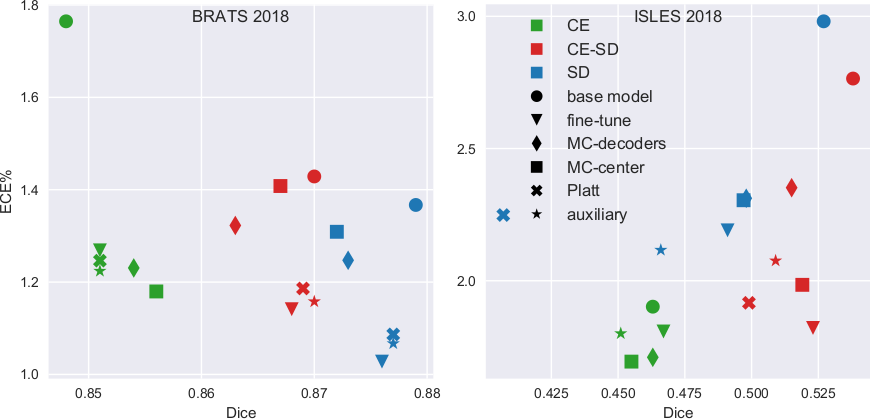

# PostTrainCalibration
> Accepted as a conference paper at ISBI 2021


This repository contains source code for ["Post training uncertainty calibration of deep networks for medical image segmentation"](https://arxiv.org/abs/2010.14290)

Neural networks for automated image segmentation are typically trained to achieve maximum accuracy, while less attention has been given to the calibration of their confidence scores. However, well-calibrated confidence scores provide valuable information towards the user. We investigate several post hoc calibration methods that are straightforward to implement, some of which are novel, and compare them to Monte Carlo dorpout.
Figure 1 shows scatter plots of ECE versus Dice score for two datasets, and for models trained on cross-entropy and soft-dice lossfunctions. For BR18, the MC methods are outperformed by simple methods like platt scaling. On IS18, fine-tuning is pareto-efficient for all weight-types. MC dropout is most effective for models trained with cross-entropy.

Overall, we find that simple post hoc methods are competitive with the popular MC dropout
<p align="center">
      
</p>
<p align="center">
    <em>Figure 1</em>
</p>

## instructions:
1. Obtain model weights and pre-process data as in https://github.com/JeroenBertels/optimizingdice
2. Place model weights in the appropriate subfolders in ./Models. rename the files to Fold_0.hdf5, Fold_1.hdf5,...
3. Place cases of the datasets in the ./Datasets/BRATS_2018 and ./Datasets/ISLES_2018 folders
4. run the retrain_dropout.py and fintune_base_model.py scripts to train the dropout and fine-tune methods
5. run make_base_model_predictions.py and then Train_aux.py to train the auxiliary models.
6. save_aux_segmaps.py, MC_predictions.py and make_fine_tune_predictions.py to save the segmentation outputs
7. Finally, run Make_evaluations.py to calculate Dice and ECE scores.

## citation
```
@misc{rousseau2020post,
      title={Post Training Uncertainty Calibration of Deep Networks For Medical Image Segmentation}, 
      author={Axel-Jan Rousseau and Thijs Becker and Jeroen Bertels and Matthew B. Blaschko and Dirk Valkenborg},
      year={2020},
      eprint={2010.14290},
      archivePrefix={arXiv},
      primaryClass={eess.IV}
}
```
